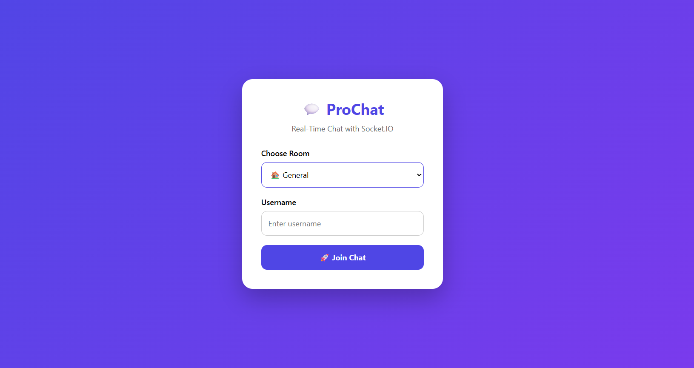
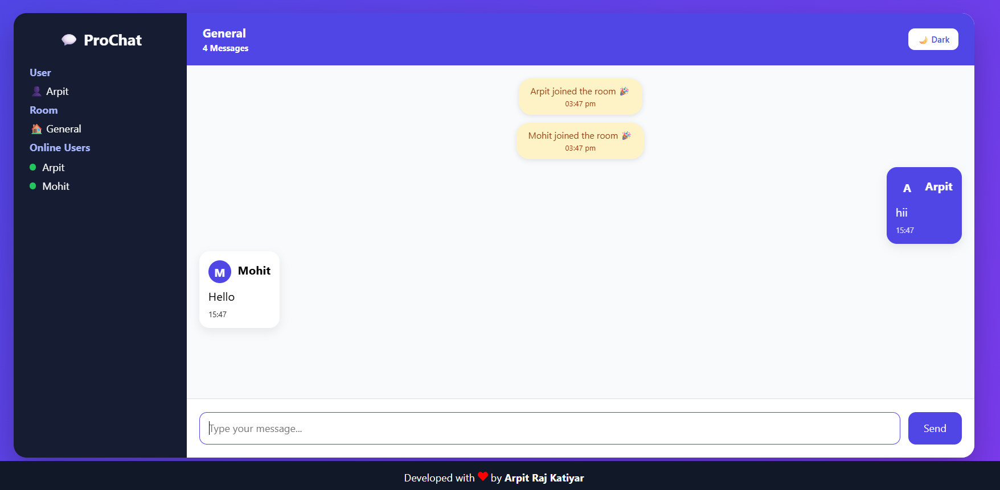
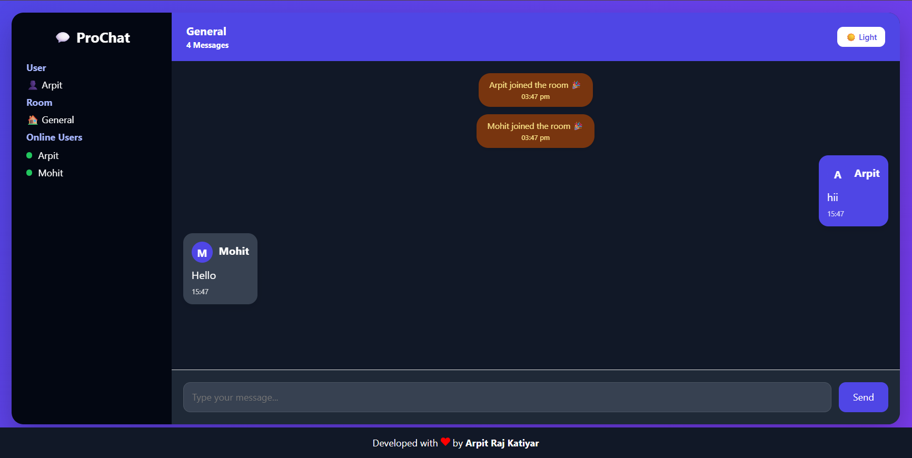
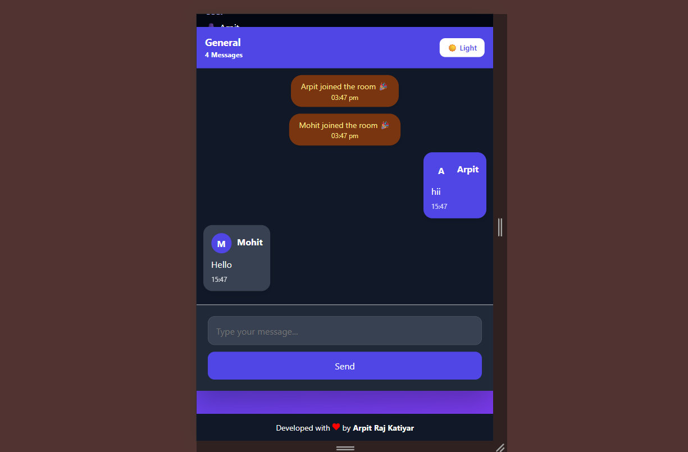

# 💬 ProChat – Real-Time Chat Application

<div align="center">


### 🚀 Modern Real-Time Chat Application built with React, Express & Socket.IO

**Developed by Arpit Raj Katiyar**

</div>

---

# 📖 Overview

ProChat is a modern real-time chat application that enables users to communicate instantly using Socket.IO.

The application provides a responsive and interactive messaging experience with multiple chat rooms, live online users, typing indicators, dark mode, and a clean Discord-inspired interface.

This project was developed as part of the **Prodesk IT Summer Engineering Internship – Sprint 12**.

---

# ✨ Features

## 💬 Real-Time Messaging

- Instant message delivery
- Socket.IO powered communication
- Auto-scroll to latest message
- Enter key to send messages

---

## 👥 Multi-Room Support

- General Room
- Developers Room
- Gaming Room

Messages remain isolated within their selected room.

---

## 🟢 Live Online Users

- Displays currently connected users
- Updates instantly when users join or leave
- Room-specific online user list

---

## ⌨️ Typing Indicator

Shows when another user is typing in the current room.

Example:

```
Rahul is typing...
```

---

## 🎉 Join & Leave Notifications

Automatically notifies everyone in the room when a user joins or leaves.

Example:

```
System
Arpit joined the room 🎉
```

---

## 🌙 Dark Mode

- Light Theme
- Dark Theme
- Instant theme switching

---

## 🎨 Modern UI

- Glassmorphism design
- Gradient backgrounds
- Animated message cards
- Responsive layout
- Professional sidebar
- Developer information panel

---

## 📱 Fully Responsive

Optimized for

- 📱 Mobile (320px+)
- 📱 Tablets
- 💻 Laptops
- 🖥 Desktop
- 🖥 2K & 4K Displays

---

## 🚀 Additional Features

- Room selection
- Username authentication
- Live message counter
- Online user indicators
- Sidebar profile section
- Auto reconnection
- Empty chat state
- Responsive mobile layout

---

# 🛠 Tech Stack

## Frontend

- React
- Vite
- Socket.IO Client
- React Icons
- CSS3

---

## Backend

- Node.js
- Express.js
- Socket.IO
- CORS
- dotenv

---

# 📂 Project Structure

```
ProChat/
│
├── client/
│   ├── src/
│   │   ├── components/
│   │   ├── pages/
│   │   ├── socket/
│   │   ├── styles/
│   │   └── App.jsx
│   │
│   └── package.json
│
├── server/
│   ├── server.js
│   ├── package.json
│   └── .env
│
└── README.md
```

---

# ⚙️ Installation

## Clone Repository

```bash
git clone https://github.com/your-username/prochat.git
```

---

## Install Frontend

```bash
cd client
npm install
```

---

## Install Backend

```bash
cd server
npm install
```

---

## Environment Variables

Create a `.env` file inside the **server** folder.

```env
PORT=5000
CLIENT_URL=http://localhost:5173
```

---

# ▶️ Run Project

### Backend

```bash
cd server
npm run dev
```

---

### Frontend

```bash
cd client
npm run dev
```

---

# 📸 Screenshots

## Join Screen



---

## Chat Dashboard



---

## Dark Mode



---

## Mobile View



---

# 🌐 Deployment

## Frontend

Deploy using:

- Vercel

---

## Backend

Deploy using:

- Render

---

# 📈 Future Enhancements

- 😀 Emoji Picker
- ❤️ Message Reactions
- 📎 File Sharing
- 🖼 Image Sharing
- 🔍 Search Messages
- ✏ Edit Messages
- 🗑 Delete Messages
- 🔔 Browser Notifications
- 📊 Chat Analytics
- 👤 User Profiles
- 📋 Copy Messages
- 🎤 Voice Messages
- 📹 Video Calling
- 🔐 Authentication with JWT
- 🗄 MongoDB Database Integration

---

# 🧠 Learning Outcomes

This project demonstrates knowledge of:

- React Development
- Express.js APIs
- Socket.IO
- Event-based Communication
- Responsive UI Design
- State Management
- Component Architecture
- Real-Time Web Applications
- Client-Server Communication
- Modern Frontend Development

---

# 🤝 Contributing

Contributions are welcome!

1. Fork the repository

2. Create a feature branch

```bash
git checkout -b feature-name
```

3. Commit your changes

```bash
git commit -m "Added new feature"
```

4. Push the branch

```bash
git push origin feature-name
```

5. Open a Pull Request

---

# 👨‍💻 Developer

## Arpit Raj Katiyar

**Frontend & Full Stack Developer**

GitHub:
https://github.com/mrark1

LinkedIn:
https://linkedin.com/in/ark0001

---

# 📄 License

This project is licensed under the MIT License.

---

<div align="center">

## ⭐ If you like this project, don't forget to Star the Repository!

Made with ❤️ by **Arpit Raj Katiyar**

</div>